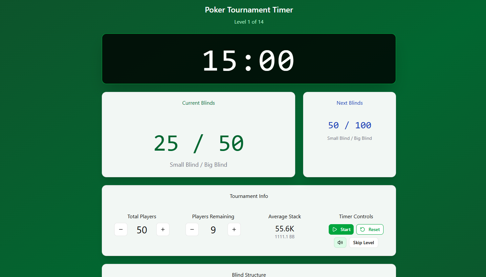

# what is this? 

A timer web application that keeps track of small/big blinds during a poker game. Intended to be projected next to or near the game.

This is a Blazor rewrite of my earlier React prototype: [poker-time](https://github.com/GillesDV/poker-timer)  

# Deployment
[https://gilles-poker-timer.azurewebsites.net/](https://gilles-poker-timer.azurewebsites.net/)  
Deployed via Azure (Github integration), auto-deploys when master is updated 🚀

# Features
- Current small & big blind shown
- Next small & big blind shown
- A countdown timer to show when the blinds will raise 
- A view to see how much each colored chip is worth
- A view with Tournament info displaying information such as: total players, current players, buttons to start & pause timer

# Tech stack:
- .NET 8.0 (LTS) 
- Blazor Server
- CSS library: [MudBlazor](https://mudblazor.com/)

# Lessons learned: 
- Blazor: 2-way binding, triggering events to update the UI
- playing around with Flex CSS 
- design-wise:
  - Figma's AI tool is very powerful, especially to get the ball rolling early. 
  - should have started with the above first. Then split up each part of the page in logical Blazor components. Would have made the process a bit smoother, rather than starting from a 'backend' mindset. eg: Write out some functionality that is definitely gonna be necessary or desirable, but then you might have to move parts of it around to other components later. 
  
# TODO:
- Clean up the style="..." in the components and use a CSS file per component or across multiple comps
- Add functionality for the remainder of the TournamentInfo tab: average stack, turning sound on/off when timer expires, showing a component with default chip values. 
- More 

# Initial Frontend mockup
